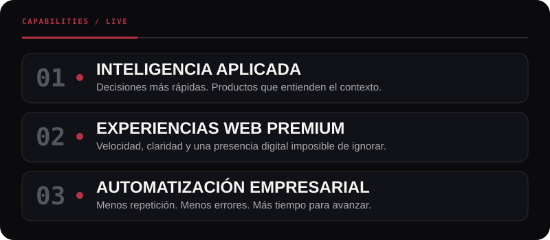
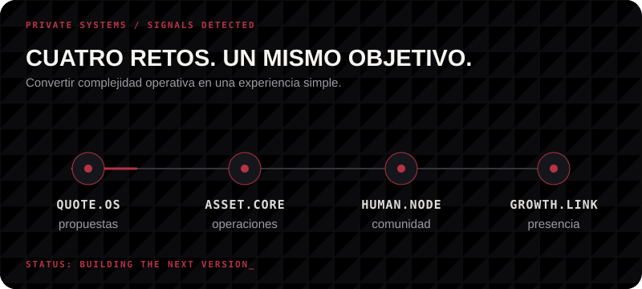
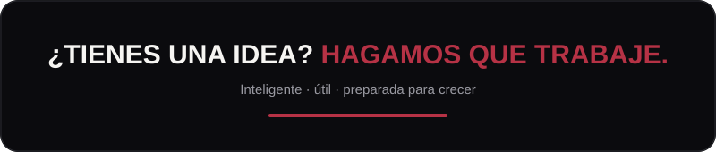

  

  

  
  
  

 

  

  

  

 

  

 

  
  

  

  <picture>
    <source media="(prefers-color-scheme: dark)" srcset="https://raw.githubusercontent.com/enrique12072024/enrique12072024/gh-pages/github-contribution-grid-snake-dark.svg" />
    <source media="(prefers-color-scheme: light)" srcset="https://raw.githubusercontent.com/enrique12072024/enrique12072024/gh-pages/github-contribution-grid-snake.svg" />
    
  </picture>

 

  

  

