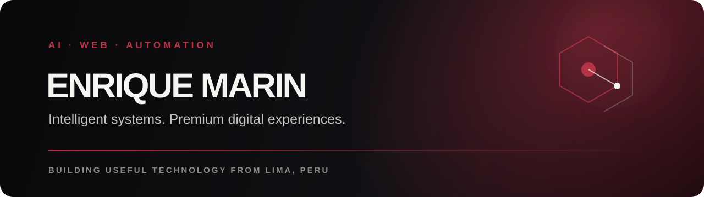

<p align="center">
  
</p>

<p align="center">
  <a href="mailto:corporationgdm@gmail.com"></a>
  
</p>

## Intelligent digital systems, built with purpose.

I build **AI-assisted products, premium web experiences, and business automations** that turn manual processes into reliable digital systems.

My work connects product thinking, practical engineering, and automation: from responsive business websites to internal platforms, quotation workflows, inventory systems, and AI-enhanced experiences.

```text
FOCUS     AI Solutions · Web Engineering · Business Automation
APPROACH  Clear architecture · Useful interfaces · Measurable outcomes
LOCATION  Lima, Peru · Building for local and global businesses
```

## What I build

| AI solutions | Premium web | Automation |
|---|---|---|
| AI-assisted workflows and intelligent product features. | Fast, responsive experiences designed around real business goals. | Systems that reduce repetitive work, errors, and operational friction. |

## Selected work

| Project | Purpose | Core technology |
|---|---|---|
| **WALLER** | B2B quotation platform with modular proposals, PDF generation, mobile workflows and resilient autosave. | Laravel · React · Vite · MySQL |
| **INVENTARIO TI** | Internal IT asset, incident and maintenance management with scoped access and REST contracts. | Laravel · React · Sanctum · MySQL |
| **NA-RUBEN** | Accessible, content-managed community platform with professional motion and a separated API. | Next.js · TypeScript · Fastify · Prisma |
| **DEVLINK** | Commercial portfolio and web-services experience for small businesses. | Next.js · TypeScript · Modern UI |

> Some client and internal systems are private. Their architecture and outcomes can be discussed without exposing confidential source code.

## Technology

<p align="center">
  
</p>

## Engineering snapshot

<p align="center">
  
  
</p>

<p align="center">
  
</p>

## Contribution flow

<p align="center">
  <picture>
    <source media="(prefers-color-scheme: dark)" srcset="https://raw.githubusercontent.com/enrique12072024/enrique12072024/output/github-contribution-grid-snake-dark.svg" />
    <source media="(prefers-color-scheme: light)" srcset="https://raw.githubusercontent.com/enrique12072024/enrique12072024/output/github-contribution-grid-snake.svg" />
    
  </picture>
</p>

## Current direction

- Building practical AI features into real business products.
- Designing premium web experiences without unnecessary complexity.
- Automating operations while keeping humans in control.
- Turning private systems into clear, publishable case studies.

<p align="center">
  <strong>Let's build something intelligent, useful, and lasting.</strong><br />
  <a href="mailto:corporationgdm@gmail.com">corporationgdm@gmail.com</a>
</p>
